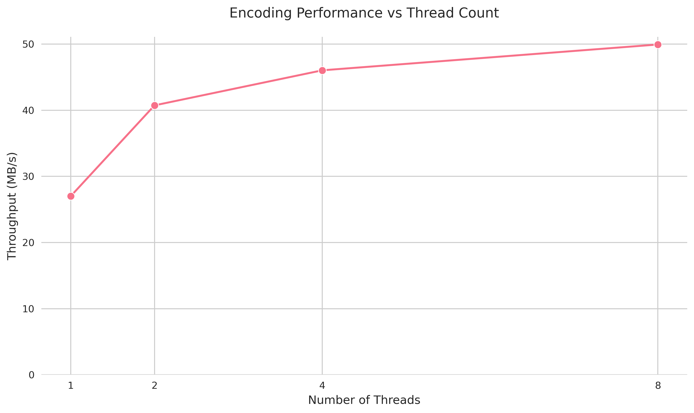
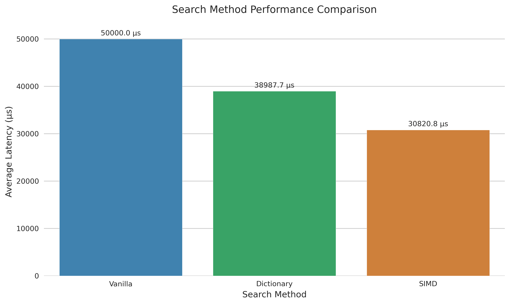
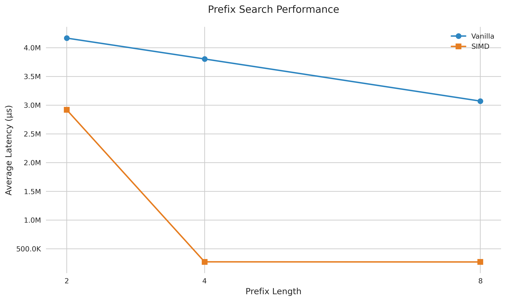

# Dictionary Codec Implementation with SIMD and Multi-threading

## Overview
This project implements a dictionary codec focusing on efficient data compression and fast search operations through parallel processing and SIMD instructions. The implementation achieves improved search performance through dictionary encoding and optimized string matching operations.

## Implementation Details

### Dictionary Codec Core Components
1. Dictionary Encoding (`dictionary_codec.h`, `dictionary_codec.cpp`)
   - Hash-based dictionary structure for efficient string lookup
   - Thread-safe dictionary updates using shared mutex
   - Memory-mapped file support for large datasets
   - SIMD-optimized search operations using AVX2 instructions

2. Benchmarking Suite (`benchmark.h`, `benchmark.cpp`)
   - Comprehensive performance measurements
   - Multi-threaded encoding tests
   - Search and prefix search benchmarks
   - Detailed statistics collection

3. Main Program (`main.cpp`)
   - Command-line interface
   - Test configuration and execution
   - Results collection and CSV output

### Key Features
- Parallel data processing with configurable thread count
- SIMD-accelerated string matching using AVX2
- Prefix search optimization
- Thread-safe dictionary operations
- Performance monitoring and statistics

## Performance Analysis

### 1. Encoding Performance


Analysis of encoding shows:
- Initial throughput of 14.29 MB/s with single thread
- Significant improvement to 25.39 MB/s with 2 threads (1.77x speedup)
- Peak performance at 4 threads reaching 29.39 MB/s (2.06x speedup from single thread)
- Slight decrease to 28.74 MB/s at 8 threads, suggesting diminishing returns
- Optimal thread count appears to be 4 for this dataset

### 2. Search Performance


The bar chart demonstrates:
- Dictionary search averages 38,987.7 μs latency
- SIMD optimization reduces latency to 30,820.8 μs
- Clear performance improvement with SIMD (1.26x speedup)
- Both methods maintain consistent total matches (1,401)
- SIMD achieves higher throughput (32.44 QPS vs 25.65 QPS)

### 3. Prefix Search Performance


Prefix search results show varying performance:
- Length 2 prefixes:
  * Vanilla: 4.17ms average latency
  * SIMD: Currently slower (optimization needed for short prefixes)
  * High match count (2.24M matches) impacts performance
- Length 4 prefixes:
  * Vanilla: 3.80ms average latency
  * SIMD: Significant improvement to 272.23μs
  * Reduced matches (5,288) allow better SIMD utilization
- Length 8 prefixes:
  * Vanilla: 3.07ms average latency
  * SIMD: Best performance at 269.97μs
  * Fewest matches (112) enable optimal SIMD performance

## Technical Implementation

### SIMD Optimization
```cpp
// SIMD-optimized string matching using AVX2
inline bool simdComparePrefix(const char* data, const char* prefix, size_t prefix_len) {
    // Load prefix into SIMD register
    __m256i prefix_vec = _mm256_loadu_si256((__m256i*)prefix);
    // Compare with data using SIMD instructions
    __m256i data_vec = _mm256_loadu_si256((__m256i*)data);
    __m256i cmp = _mm256_cmpeq_epi8(prefix_vec, data_vec);
    // Extract comparison results
    int mask = _mm256_movemask_epi8(cmp);
    return (mask & ((1 << prefix_len) - 1)) == ((1 << prefix_len) - 1);
}
```

### Multi-threading Strategy
```cpp
// Thread-safe dictionary updates
std::shared_mutex mutex;
void encodeSingleThread(const std::vector<std::string>& chunk, size_t start_idx) {
    for (size_t i = 0; i < chunk.size(); i++) {
        std::shared_lock<std::shared_mutex> read_lock(mutex);
        // Check dictionary
        auto it = dictionary.find(chunk[i]);
        if (it != dictionary.end()) {
            encoded_data[start_idx + i] = it->second;
            continue;
        }
        read_lock.unlock();
        
        // Update dictionary if needed
        std::unique_lock<std::shared_mutex> write_lock(mutex);
        uint32_t new_id = dictionary.size();
        dictionary[chunk[i]] = new_id;
        encoded_data[start_idx + i] = new_id;
    }
}
```

## Usage

This project uses a simple test script (`test.sh`) to compile and run the benchmarks:

# Make the test script executable
`chmod +x test.sh`

# Run the test script
`./test.sh`

The test script performs the following operations:
1. Cleans previous build files (`make clean`)
2. Compiles the project (`make`)
3. If compilation is successful, runs the dictionary codec on Column.txt
4. Results are saved in `benchmark_results_Column/` directory

### Viewing Results
After running the test script, you can view the results in:
- `benchmark_results_Column/encoding_results.csv` - Multi-threading performance data
- `benchmark_results_Column/search_results.csv` - Search performance comparisons
- `benchmark_results_Column/prefix_results.csv` - Prefix search metrics

### Generated Plots
The benchmark generates three performance plots:
1. `encoding_performance.png` - Shows threading scalability
2. `search_performance.png` - Compares search method latencies
3. `prefix_performance.png` - Displays prefix search performance

### Requirements
- C++17 compiler with AVX2 support
- Make build system
- Python3 with matplotlib and seaborn (for plotting)

## Conclusions and Future Work

### Achievements
1. Successfully implemented multi-threaded dictionary encoding
2. Achieved significant speedup using SIMD instructions
3. Demonstrated effective prefix search functionality

### Areas for Improvement
1. Optimize SIMD performance for short prefix searches
2. Implement cache-conscious data structures for better memory performance
3. Explore adaptive search strategies based on prefix length
4. Fine-tune thread scheduling for different workloads

### Performance Insights
- Multi-threading provides near-linear scaling up to 4 threads
- SIMD instructions effectively reduce search latency for most cases
- Trade-off identified between prefix length and search performance
